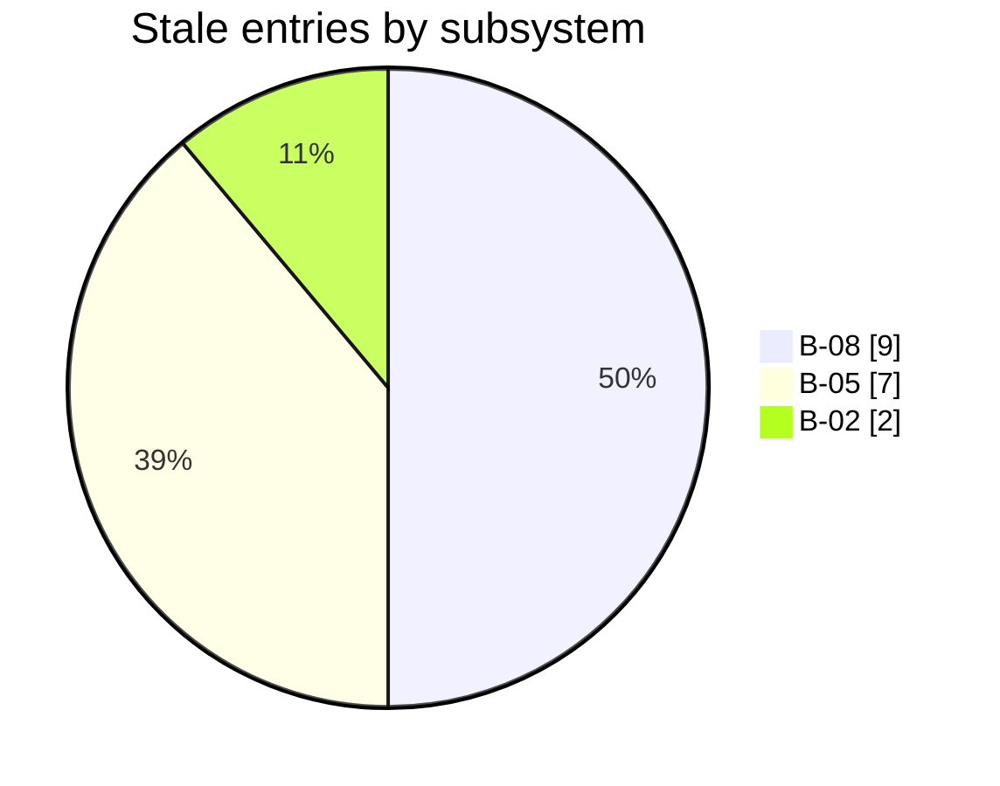

# Architecture

## Runtime boundary map

_Projected from the recorded [onboarding runtime boundary table](onboarding-report.md#runtime-boundary-map); mechanisms and targets are preserved as surveyed._

| Runtime / Process | Language | Communicates with | Mechanism | Notes |
|---|---|---|---|---|
| Host agent runtime | external | MCP server | stdio MCP | Starts the server with a workspace path. `.mcp.json@b8b566f`. |
| `amanuensis-memory` | Node/TypeScript | host, SQLite, git, Python | MCP stdio, native SQLite binding, subprocess | Owns validation and durable records. `mcp-server/src/index.ts:main@b8b566f`. |
| SQLite `memory.db` | SQL | MCP server and materializer | WAL; one writer API, read-only materializer connection | Schema initializes and migrates on open. `mcp-server/src/db.ts:openDatabase@b8b566f`. |
| Git storage history | git subprocess | storage directory | synchronous child process | Commits DB/prose state at gates. `mcp-server/src/storage-git.ts:commitStorage@b8b566f`. |
| Python materializer | Python | SQLite and prose storage | child process and filesystem | Emits docs and `.manifest.json`. `materializer/amanuensis_materializer/core.py:Materializer.materialize@b8b566f`. |
| Installer CLI | Node/TypeScript | workspace files | filesystem/config merge | Writes agents and VS Code MCP config. `mcp-server/src/cli.ts:plan@b8b566f`. |

## Subsystem dependency graph

| From | Relationship | To | Strength | Context |
|---|---|---|---|---|
| **[B-03](subsystems/b03-knowledge-tools-and-workflow-api.md)** Knowledge tools and workflow API | data-flow | **[B-04](subsystems/b04-diff-aware-materializer.md)** Diff-aware materializer | confirmed | Staleness flows from [B-03](subsystems/b03-knowledge-tools-and-workflow-api.md)'s detect_changes into [B-04](subsystems/b04-diff-aware-materializer.md)'s staleness_map projection via the entries table (seam [SM-09](seams.md#sm-09)). Because no writer inserts rows, the defect propagates from an inert internal metric ([B03-2](findings.md#b03-2)) into a published freshness claim in the primary reading surface ([B04-1](findings.md#b04-1)). |

## Seam topology

| Seam | Party A | Shared object | Party B |
|---|---|---|---|
| **[SM-01](seams.md#sm-01)** | **[B-01](subsystems/b01-survey-methodology-and-agent-contracts.md)** Survey methodology and agent contracts | MCP tool protocol and survey phase contract | **[B-03](subsystems/b03-knowledge-tools-and-workflow-api.md)** Knowledge tools and workflow API |
| **[SM-02](seams.md#sm-02)** | **[B-02](subsystems/b02-mcp-core-persistence-and-lifecycle.md)** MCP core, persistence, and lifecycle | ServerContext and memory.db | **[B-03](subsystems/b03-knowledge-tools-and-workflow-api.md)** Knowledge tools and workflow API |
| **[SM-03](seams.md#sm-03)** | **[B-03](subsystems/b03-knowledge-tools-and-workflow-api.md)** Knowledge tools and workflow API | materialize_docs subprocess and storage/docs projection | **[B-04](subsystems/b04-diff-aware-materializer.md)** Diff-aware materializer |
| **[SM-04](seams.md#sm-04)** | **[B-05](subsystems/b05-packaging-installer-validation-and-product-docs.md)** Packaging, installer, validation, and product docs | packaged agent and reference mirrors | **[B-01](subsystems/b01-survey-methodology-and-agent-contracts.md)** Survey methodology and agent contracts |
| **[SM-05](seams.md#sm-05)** | **[B-05](subsystems/b05-packaging-installer-validation-and-product-docs.md)** Packaging, installer, validation, and product docs | packaged Python materializer mirror | **[B-04](subsystems/b04-diff-aware-materializer.md)** Diff-aware materializer |
| **[SM-06](seams.md#sm-06)** | **[B-06](subsystems/b06-report-interface-design-and-validation-studies.md)** Report interface design and validation studies | report projection design/component contract | **[B-04](subsystems/b04-diff-aware-materializer.md)** Diff-aware materializer |
| **[SM-07](seams.md#sm-07)** | **[B-06](subsystems/b06-report-interface-design-and-validation-studies.md)** Report interface design and validation studies | reporting terminology and information-architecture contract | **[B-01](subsystems/b01-survey-methodology-and-agent-contracts.md)** Survey methodology and agent contracts |
| **[SM-08](seams.md#sm-08)** | **[B-07](subsystems/b07-embedded-research-surveys-and-platform-trials.md)** Embedded research surveys and platform trials | research-backed report design constraints | **[B-06](subsystems/b06-report-interface-design-and-validation-studies.md)** Report interface design and validation studies |
| **[SM-09](seams.md#sm-09)** | **[B-03](subsystems/b03-knowledge-tools-and-workflow-api.md)** Knowledge tools and workflow API | entries table (staleness columns: stale, stale_since, stale_reason) | **[B-04](subsystems/b04-diff-aware-materializer.md)** Diff-aware materializer |
| **[SM-10](seams.md#sm-10)** | **[B-01](subsystems/b01-survey-methodology-and-agent-contracts.md)** Survey methodology and agent contracts | activation contract (installation scope, skill destination, config markers) | **[B-05](subsystems/b05-packaging-installer-validation-and-product-docs.md)** Packaging, installer, validation, and product docs |

## Staleness map

