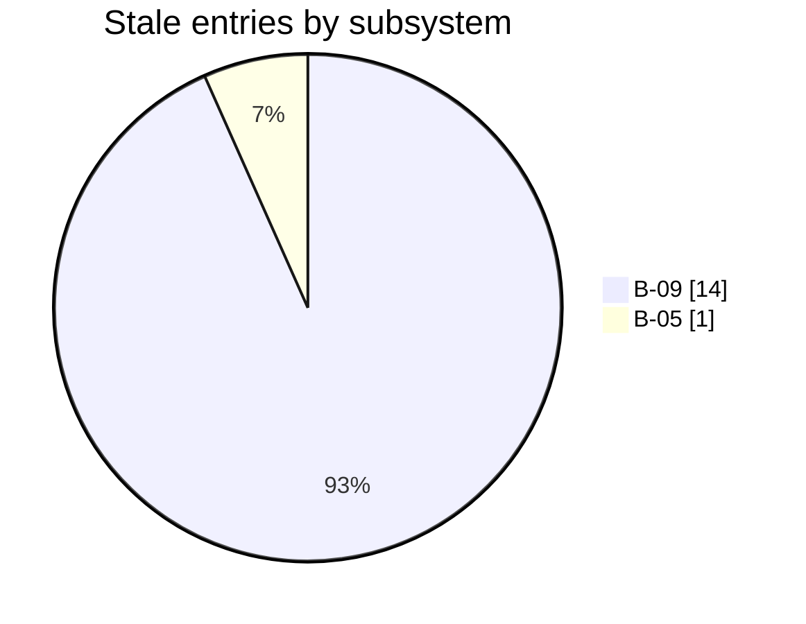

# Architecture

## Runtime boundary map

_No structured runtime boundary map is recorded yet._

## Subsystem atlas

_No dependency edges are recorded in this publication. The layer map below is a subsystem atlas, not an inferred dependency graph._

| Region | Subsystem | Survey depth |
|---|---|---|
| Coordination | **[B-01](subsystems/b01-survey-methodology-and-agent-contracts.md)** Survey methodology and agent contracts | adversarial |
| Delivery | **[B-05](subsystems/b05-packaging-installer-validation-and-product-docs.md)** Packaging, installer, validation, and product docs | concerns |
| Delivery | **[B-08](subsystems/b08-activation-evidence-and-release-readiness.md)** Activation evidence and release readiness | unmapped |
| Design evidence | **[B-06](subsystems/b06-report-interface-design-and-validation-studies.md)** Report interface design and validation studies | unmapped |
| Design evidence | **[B-09](subsystems/b09-conspectus-design-lanes-their-drivers-and-receipts.md)** Conspectus design lanes, their drivers and receipts | unmapped |
| Projection | **[B-04](subsystems/b04-diff-aware-materializer.md)** Diff-aware materializer | adversarial |
| Research evidence | **[B-07](subsystems/b07-embedded-research-surveys-and-platform-trials.md)** Embedded research surveys and platform trials | concerns |
| Runtime | **[B-02](subsystems/b02-mcp-core-persistence-and-lifecycle.md)** MCP core, persistence, and lifecycle | adversarial |
| Runtime | **[B-03](subsystems/b03-knowledge-tools-and-workflow-api.md)** Knowledge tools and workflow API | adversarial |

## Seam topology

_No seams recorded yet._

## Staleness map

